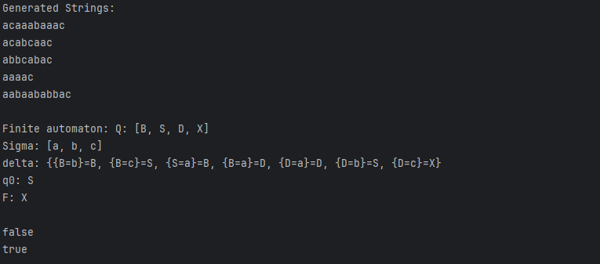

# Intro to formal languages. Regular grammars. Finite Automata

### Course: Formal Languages & Finite Automata
### Author: Cvasiuc Dmitrii

----
## Objectives:

* Implement a type/class for your grammar;

* Add one function that would generate 5 valid strings from the language expressed by your given grammar;

* Implement some functionality that would convert and object of type Grammar to one of type Finite Automaton;

* For the Finite Automaton, please add a method that checks if an input string can be obtained via the state transition from it;

I had the 13th variant, which is the following: <br>
VN={S, B, D} <br>
VT={a, b, c} <br>
P={ <br>
S → aB <br>
B → aD <br>
B → bB <br>
D → aD <br>
D → bS <br>
B → cS <br>
D → c <br>
}

## Implementation description
Implemented the Grammar class, which generates strings, and transform the Grammar to the Finite Automaton type.
Also, made a method which checks if the string matches DFA.
<br>
Here is the part (method) which generates the string itself:
```java
public String generateString() {
    return generateStringFromSymbol(startSymbol);
}

private String generateStringFromSymbol(String symbol) {
    if (!nonTerminals.contains(symbol)) {
        return symbol;
    }

    List<String> possibleProductions = new ArrayList<>();
    for (ProductionRule productionRule : productionRules) {
        if (productionRule.getLeftHandSymbol().equals(symbol)) {
            possibleProductions.add(productionRule.getRightHandSymbol());
        }
    }

    if (possibleProductions.isEmpty()) {
        throw new IllegalArgumentException("No production rules found for symbol: " + symbol);
    }

    Random random = new Random();
    String selectedProduction = possibleProductions.get(random.nextInt(possibleProductions.size()));

    StringBuilder result = new StringBuilder();
    for (char ch : selectedProduction.toCharArray()) {
        result.append(generateStringFromSymbol(String.valueOf(ch)));
    }

    return result.toString();
}
```
Here is the part which converts grammar to DFA:
```java
public FiniteAutomaton toFiniteAutomaton() {
    List<String> Q = new ArrayList<>(nonTerminals);
    List<String> Sigma = new ArrayList<>(terminals);
    HashMap<HashMap<String, String>, String> delta = new HashMap<>();
    String q0 = startSymbol;
    String F = "X";
    Q.add(F);

    for (ProductionRule productionRule : productionRules) {
        String rightHandSymbol = productionRule.getRightHandSymbol();
        String leftHandSymbol = productionRule.getLeftHandSymbol();
        HashMap<String, String> transitionKey = new HashMap<>();
        if (rightHandSymbol.length() == 2) {
            transitionKey.put(leftHandSymbol, String.valueOf(rightHandSymbol.charAt(0)));
            delta.put(transitionKey, String.valueOf(rightHandSymbol.charAt(1)));
        }
        else {
            transitionKey.put(leftHandSymbol, rightHandSymbol);
            delta.put(transitionKey, F);
        }
    }

    return new FiniteAutomaton(Q, Sigma, delta, q0, F);
}
```
It is the method which checks if string respects the rules of FA:
```java
public boolean stringBelongToLanguage(final String inputString) {
    String currentState = q0;
    char cursor;

    for (int i = 0; i < inputString.length(); i++) {
        cursor = inputString.charAt(i);
        HashMap<String, String> key = new HashMap<>();
        key.put(currentState, Character.toString(cursor));
        String value = delta.get(key);
        if (value == null) {
            return false;
        }
        currentState = value;
    }
    return true;
}
```
Here is the main class itself:
```java
public static void main(String[] args) {
    Set<String> nonTerminals = new HashSet<>(Arrays.asList("S", "B", "D"));
    Set<String> terminals = new HashSet<>(Arrays.asList("a", "b", "c"));

    List<ProductionRule> productionRules = new ArrayList<>();
    productionRules.add(new ProductionRule("S", "aB"));
    productionRules.add(new ProductionRule("B", "aD"));
    productionRules.add(new ProductionRule("B", "bB"));
    productionRules.add(new ProductionRule("D", "aD"));
    productionRules.add(new ProductionRule("D", "bS"));
    productionRules.add(new ProductionRule("B", "cS"));
    productionRules.add(new ProductionRule("D", "c"));

    String startSymbol = "S";

    Grammar grammar = new Grammar(nonTerminals, terminals, productionRules, startSymbol);

    System.out.println("Generated Strings:");
    for (int i = 0; i < 5; i++) {
        System.out.println(grammar.generateString());
    }

    FiniteAutomaton automaton = grammar.toFiniteAutomaton();
    System.out.println("\nFinite automaton: " + automaton.toString());


    System.out.println(automaton.stringBelongToLanguage("acb"));
    System.out.println(automaton.stringBelongToLanguage("acaac"));
}
```


## Conclusions / Screenshots / Results
* Screenshots, how it works:
  

In this lab, I was able to:
- Gain an understanding of the structure and elements of formal languages.
- Create a grammar based on the given variant.
- Generate valid strings and convert the grammar into a finite automaton.
- Use the finite automaton to verify if strings belong to the language.

## Repository Link
[GitHub Repository](https://github.com/dmitrycvs/LFA/tree/main/src/main/java/lfa/practice)

---

## References
1. Java Documentation: [https://docs.oracle.com/javase/](https://docs.oracle.com/javase/)

---