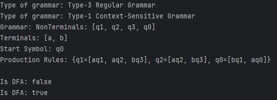

# Determinism in Finite Automata. Conversion from NDFA 2 DFA. Chomsky Hierarchy.

### Course: Formal Languages & Finite Automata
### Author: Cvasiuc Dmitrii

----
## Objectives:

* Provide a function in your grammar type/class that could classify the grammar based on Chomsky hierarchy.

* Implement conversion of a finite automaton to a regular grammar.

* Determine whether your FA is deterministic or non-deterministic.

* Implement some functionality that would convert an NDFA to a DFA.

I had the 13th variant, which is the following: <br>
Q = {q0,q1,q2,q3}, <br>
∑ = {a,b}, <br>
F = {q3}, <br> 
δ(q0,a) = q0, <br> 
δ(q0,b) = q1, <br>
δ(q1,a) = q1, <br>
δ(q1,a) = q2, <br>
δ(q1,b) = q3, <br>
δ(q2,a) = q2, <br>
δ(q2,b) = q3. <br>
}

## Implementation description
Added a method in the FiniteAutomaton Class which transform the FA into Regular Grammar:
<br>
```java
public Grammar toGrammar() {
    Set<String> nonTerminals = new HashSet<>();
    Set<String> terminals = new HashSet<>(Sigma);
    HashMap<String, List<String>> productionRules = new HashMap<>();
    String startSymbol = q0;

    for (String state : Q) {
        nonTerminals.add(state);
    }

    for (Map.Entry<HashMap<String, String>, List<String>> entry : delta.entrySet()) {
        HashMap<String, String> transitionKey = entry.getKey();
        List<String> destinationStates = entry.getValue();

        String sourceState = transitionKey.keySet().iterator().next();
        String inputSymbol = transitionKey.get(sourceState);

        for (String destState : destinationStates) {
            String productionRight = inputSymbol + destState;

            productionRules.computeIfAbsent(sourceState, k -> new ArrayList<>()).add(productionRight);
        }
    }

    return new Grammar(nonTerminals, terminals, productionRules, startSymbol);
}
```
Also I had implemented a method in the same class to transfrom DFA into NFA:
<br>
```java
public FiniteAutomaton toDFA() {
    List<String> newQ = new ArrayList<>();
    List<String> newSigma = new ArrayList<>(this.Sigma);
    HashMap<HashMap<String, String>, List<String>> newDelta = new HashMap<>();
    String newQ0;
    Set<String> newF = new HashSet<>();

    Map<Set<String>, String> stateSetToName = new HashMap<>();
    Map<String, Set<String>> nameToStateSet = new HashMap<>();

    Set<String> initialStateSet = new HashSet<>();
    initialStateSet.add(this.q0);
    newQ0 = "S0";
    stateSetToName.put(initialStateSet, newQ0);
    nameToStateSet.put(newQ0, initialStateSet);
    newQ.add(newQ0);

    Queue<Set<String>> unprocessedStateSets = new LinkedList<>();
    unprocessedStateSets.add(initialStateSet);
    
    int stateCounter = 1;

    while (!unprocessedStateSets.isEmpty()) {
        Set<String> currentStateSet = unprocessedStateSets.poll();
        String currentStateName = stateSetToName.get(currentStateSet);
        
        if (currentStateSet.contains(this.F)) {
            newF.add(currentStateName);
        }

        for (String symbol : this.Sigma) {
            Set<String> nextStateSet = new HashSet<>();

            for (String state : currentStateSet) {
                HashMap<String, String> transitionKey = new HashMap<>();
                transitionKey.put(state, symbol);

                List<String> nextStates = this.delta.get(transitionKey);
                if (nextStates != null) {
                    nextStateSet.addAll(nextStates);
                }
            }

            if (nextStateSet.isEmpty()) {
                continue;
            }

            String nextStateName;
            if (!stateSetToName.containsKey(nextStateSet)) {
                nextStateName = "S" + stateCounter++;
                stateSetToName.put(nextStateSet, nextStateName);
                nameToStateSet.put(nextStateName, nextStateSet);
                newQ.add(nextStateName);
                unprocessedStateSets.add(nextStateSet);
            } else {
                nextStateName = stateSetToName.get(nextStateSet);
            }

            HashMap<String, String> newTransitionKey = new HashMap<>();
            newTransitionKey.put(currentStateName, symbol);
            List<String> destinationState = new ArrayList<>();
            destinationState.add(nextStateName);
            newDelta.put(newTransitionKey, destinationState);
        }
    }

    String newFinalState = newF.isEmpty() ? null : newF.iterator().next();

    return new FiniteAutomaton(newQ, newSigma, newDelta, newQ0, newFinalState);
}
```
And I have been classified the grammar based on Chomsky hierarchy:
```java
public String classifyByChomskyHierarchy() {
    if (isRegularGrammar()) {
        return "Type-3 Regular Grammar";
    } else if (isContextFreeGrammar()) {
        return "Type-2 Context-Free Grammar";
    } else if (isContextSensitiveGrammar()) {
        return "Type-1 Context-Sensitive Grammar";
    } else {
        return "Type-0 Unrestricted Grammar";
    }
}

private boolean isRegularGrammar() {
    for (Map.Entry<String, List<String>> entry : productionRules.entrySet()) {
        List<String> productions = entry.getValue();

        for (String production : productions) {
            if (production.isEmpty()) {
                return false;
            }

            boolean isSingleTerminal = production.length() == 1 && terminals.contains(production);
            boolean isTerminalNonTerminal = false;
            if (production.length() == 2) {
                String firstChar = production.substring(0, 1);
                String secondChar = production.substring(1);
                isTerminalNonTerminal = terminals.contains(firstChar) && nonTerminals.contains(secondChar);
            }

            if (!isSingleTerminal && !isTerminalNonTerminal) {
                return false;
            }
        }
    }
    return true;
}

private boolean isContextFreeGrammar() {
    for (Map.Entry<String, List<String>> entry : productionRules.entrySet()) {
        String leftHandSide = entry.getKey();

        if (!nonTerminals.contains(leftHandSide) || leftHandSide.length() != 1) {
            return false;
        }
    }
    return true;
}

private boolean isContextSensitiveGrammar() {
    for (Map.Entry<String, List<String>> entry : productionRules.entrySet()) {
        String leftHandSide = entry.getKey();
        List<String> productions = entry.getValue();

        for (String rightHandSide : productions) {
            if (rightHandSide.isEmpty()) {
                if (!leftHandSide.equals(startSymbol)) {
                    return false;
                }

                for (List<String> allProductions : productionRules.values()) {
                    for (String rhs : allProductions) {
                        if (rhs.contains(startSymbol)) {
                            return false;
                        }
                    }
                }
            }

            if (rightHandSide.length() < leftHandSide.length() && !(leftHandSide.equals(startSymbol) && rightHandSide.isEmpty())) {
                return false;
            }
        }
    }
    return true;
}
```

## Conclusions / Screenshots / Results
* Screenshots, how it works:
  

In this lab, I was able to:
- Develop a comprehensive understanding of what an automaton is and its applications in formal language theory.
- Implement a function within the grammar type/class to classify the grammar based on the Chomsky hierarchy.
- Successfully convert the finite automaton to a regular grammar.
- Determine whether my finite automaton is deterministic or non-deterministic.
- Implement functionality to convert a non-deterministic finite automaton (NDFA) to a deterministic finite automaton (DFA).

## Repository Link
[GitHub Repository](https://github.com/dmitrycvs/LFA/tree/main/src/main/java/lfa/practice)

---

## References
1. Java Documentation: [https://docs.oracle.com/javase/](https://docs.oracle.com/javase/)

---